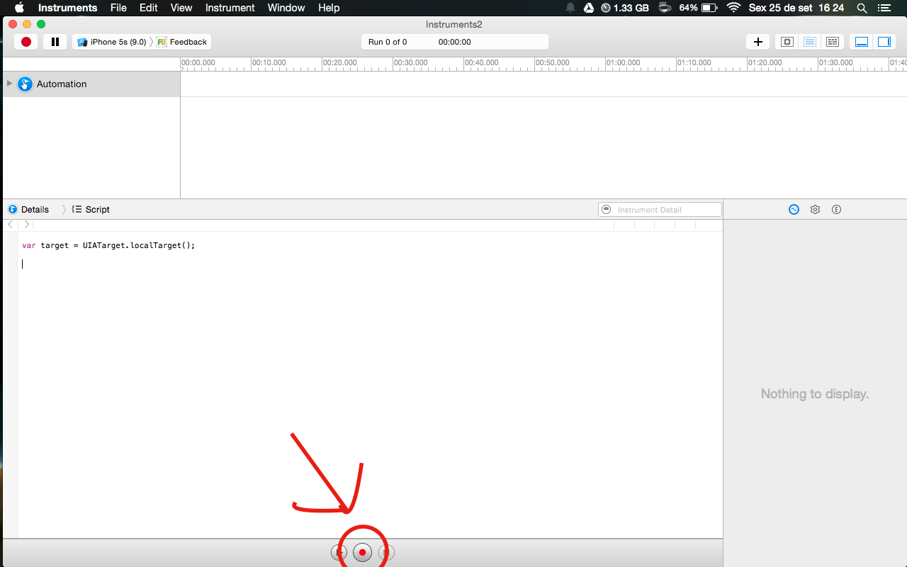

## Tifast Snapshot
Esse comando é usado para criar todas Fotos, com suporte a várias línguas, para o seu app.

Antes de executar `tifast snapshot` você precisa configurar algumas coisas.

* Abre seu app Xcode no modo "Profile"(`CMD + i`), Escolha `Automation` e clique no botão "Record".

* O Xcode vai começar a gravar tudo o que você faz no app. Copie o código gerado para dentro do arquivo `snapshot.js`, certifique-se de deixar o "import" no início do código.

* Para tirar Fotos, use `captureLocalizedScreenshot('0-nome')` no código.

Aqui está um exemplo do `snapshot` funcionando:

#### Esse é o HTML gerado pelo Snapshot

### Snapfile
Você pode customizar seu `Snapfile` do jeito que você quiser. Para mais opções, cheque a [documentação oficial do Snapshot](https://github.com/KrauseFx/snapshot)
